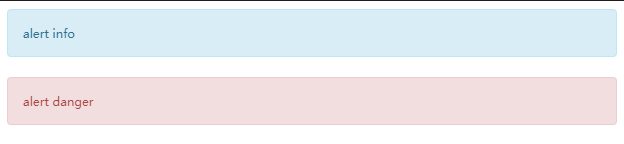

# scss 学习

## 嵌套规则

```css
.container {
  width: 100px;
}
.container a {
  color: red;
}
.container a:hover {
  text-decoration: underline;
  color: green;
}
.container .top {
  border-top: 1px red solid;
}
.container .top-left {
  border-left: 1px blue solid;
}
```

```scss
.container {
  width: 100px;
  a {
    color: red;
    &:hover {
      text-decoration: underline;
      color: green;
    }
  }
  .top {
    border-top: 1px red solid;
    &-left {
      border-left: 1px blue solid;
    }
  }
}
```

### 选择器嵌套

1. 选择器嵌套，形成后代选择器

2. `&` 获取父级选择器

3. 父级选择器可结合其他字符串，生成新的后代选择器

### 属性嵌套

```css
.container {
  width: 100px;
  color: yellow;
  font-size: 16px;
  font-weight: bold;
}
```

```scss
.container {
  color: yellow;
  // 需要`:`
  font: {
    size: 16px;
    weight: bold;
  }
}
```

### 变量

css 的变量

```css
:root {
  --font-color: red;
}

body {
  color: var(--font-color);
}

.container {
  --font-color: green;
  color: var(--font-color);
}

.hello {
  --font-color: yellow;
  color: var(--font-color);
}
```

> 作用域：后代选择器里定义的变量覆盖父级的同名变量。

scss 的变量：使用`$`作为前缀。

```scss
$font-color: blue;
:root {
  $font-color: red;
}

body {
  color: $font-color;
}

.container {
  $font-color: green;
  color: $font-color;
}

.hello {
  color: $font-color;
}
```

> 作用域：局部变量覆盖全局变量

> 值有哪些类型：

1. 数字：`1`，`2`，`10px`

2. 字符串：`'foo'`

3. 颜色： rgb， hex 或者文字

4. 布尔值： true false

5. 空值：null

6. 数组（list)：`1px 20px` 是逗号或者空格作为分隔符

7. map：`(key1:value,key2:value2)`

```scss
$layer-index: 10;
$border-width: 10px;
$font-family: 'Open Sans';
$blank-mode: true;
$has-value: null;
$base-padding: 1px 2px 3px 4px;
$color-map: (
  color1: red,
  color2: green,
);

$font-color: red;

:root {
  $font-color: blue;
}

body {
  color: $font-color;
}

.container {
  $font-color: green;
  color: $font-color;
  z-index: $layer-index;
  @if $blank-mode {
    color: lightpink;
  } @else {
    color: $font-color;
  }
  &::after {
    display: inline-block;
    // content: length($base-padding);// 4
    // content: type-of($base-padding); // list
    content: type-of($value: $has-value);
    // content: 'hi';
    color: map-get($map: $color-map, $key: 'color1');
  }
}

.hello {
  color: $font-color;
  font-size: 60px;
}
```

变量默认值：

```scss
$border-width: 5px !default; // 如果变量已经定义，使用定义的值
$border-width-2: 5px !global; // 改变为全局变量
// 未定义，是这个值
// NOTE 之一 default 前面的 !
```

## 导入

css 引入

```css
@import url(css-file-path-with-ex);
@import url(./var.css);
```

scss 引入

```scss
@import 'scss-file-path';
@import 'var.scss';
@import 'var';
```

哪些情况视为 css 导入：

1. 扩展名为`.css`

2. 路径以`http://`开头

3. 使用`url`语法

4. @import 包含媒体查询

```scss
@import 'var.css';
@import 'http://exmaple.com/css.css';
@import url('var.css');
@import 'landscape' screen and (orientation landscape);
```

> 如何让 scss 文件不编译产生`.css`文件

文件名称使用`_`开头。

局部文件不需要生产`.css`文件。

> 可在哪些位置导入？

文件头部、选择器内部。

```scss
body {
  @import 'var';
}
```

## 混入 mixin

混入（mixin）用于定义**可重复**使用的片段，混入指令包含所有 CSS 规则，绝大部分 SCSS 规则，支持传递参数、默认值、位置参数和不定参数，位置参数、默认值和不定参数都需要在后面。

> 比较推荐的实践：添加默认值，使用位置参数。

```scss
body {
  @mixin block($top, $right, $bottom: 2px, $left: 5px) {
    width: 100px;
    height: 100px;
    border: {
      width: 10px;
      color: red;
      style: solid;
    }
    padding: {
      top: $top;
      right: $right;
      bottom: $bottom;
      left: $left;
    }
  }
  .container {
    @include block(10px, $right: 20px);
    // 位置参数需要在后面，这种不行
    // @include block($right: 20px，10px);
    color: lightgreen;
  }
}
```

编译输出：

```css
body .container {
  width: 100px;
  height: 100px;
  border-width: 10px;
  border-color: red;
  border-style: solid;
  padding-top: 10px;
  padding-right: 0;
  padding-bottom: 2px;
  padding-left: 5px;
  color: lightgreen;
}
```

不定参数，对于具有多个属性值的 css 属性而言，不定参数对混入尤其有用。

```scss
@mixin liner-gradient($direction, $rest...) {
  background-color: nth($rest, 0); // NOTE rest 是数组，获取 下标为 1 的元素
  background-image: linear-gradient($direction, $rest);
}
.container {
  @include block(10px, $right: 10px);
  @include liner-gradient(to right, red, orange, yellow);
  color: lightgreen;
}
```

liner-gradient 编译结果：

```css
background-color: red;
background-image: linear-gradient(to right, red, orange, yellow);
```

> 哪些场景适合混入？

属性一样，属性值不同的重复样式。

## 继承 extend

有这些样式

```css
.alert {
  padding: 15px;
  margin-bottom: 20px;
  border: 1px solid transparent;
  border-radius: 4px;
  font-size: 12px;
}
.alert-info {
  color: #31708f;
  background-color: #d9edf7;
  border-color: #bce8f1;
}
.alert-danger {
  color: #a94442;
  background-color: #f2dede;
  border-color: #ebccd1;
}
```

```html
<div class="alert-info">alert info</div>
<div class="alert alert-danger">alert danger</div>
```



使用继承完成上述功能：

```scss
.alert {
  padding: 15px;
  margin-bottom: 20px;
  border: 1px solid transparent;
  border-radius: 4px;
  font-size: 12px;
}
.alert-info {
  @extend .alert;
  color: #31708f;
  background-color: #d9edf7;
  border-color: #bce8f1;
}
.alert-danger {
  @extend .alert;
  color: #a94442;
  background-color: #f2dede;
  border-color: #ebccd1;
}
```

编译结果：

```css
.alert,
.alert-danger,
.alert-info {
  padding: 15px;
  margin-bottom: 20px;
  border: 1px solid transparent;
  border-radius: 4px;
  font-size: 12px;
}

.alert-info {
  color: #31708f;
  background-color: #d9edf7;
  border-color: #bce8f1;
}

.alert-danger {
  color: #a94442;
  background-color: #f2dede;
  border-color: #ebccd1;
}
```

`@extend` 对选择器进行继承时，会对选择器进行合并，形成分组选择器。

html 变化：

```html
<div class="alert-info">alert info</div>
<div class="alert-danger">alert danger</div>
```

多继承

```scss
.alert {
  padding: 15px;
  margin-bottom: 20px;
  border: 1px solid transparent;
  border-radius: 4px;
  font-size: 12px;
}
.important {
  font: {
    size: 14px;
    weight: bold;
  }
}
.alert-info {
  @extend .alert;
  color: #31708f;
  background-color: #d9edf7;
  border-color: #bce8f1;
}
.alert-danger {
  @extend .alert;
  @extend .important;
  color: #a94442;
  background-color: #f2dede;
  border-color: #ebccd1;
}
```

编译结果：

```css
.alert,
.alert-danger,
.alert-info {
  padding: 15px;
  margin-bottom: 20px;
  border: 1px solid transparent;
  border-radius: 4px;
  font-size: 12px;
}

.important,
.alert-danger {
  font-size: 14px;
  font-weight: bold;
}

.alert-info {
  color: #31708f;
  background-color: #d9edf7;
  border-color: #bce8f1;
}

.alert-danger {
  color: #a94442;
  background-color: #f2dede;
  border-color: #ebccd1;
}
```

`.alert-danger` 和多个选择器合并形成分组选择器。

可能会产生多余的选择器，往往是被继承的选择器。

## 占位符选择器 (%)

占位符选择器可解决继承生产冗余选择器的问题。

`%placeholder` 和 `@extend` 一起使用。

```scss
%alert {
  padding: 15px;
  margin-bottom: 20px;
  border: 1px solid transparent;
  border-radius: 4px;
  font-size: 12px;
}

.alert-info {
  @extend %alert;
  color: #31708f;
  background-color: #d9edf7;
  border-color: #bce8f1;
}
.alert-danger {
  @extend %alert;
  color: #a94442;
  background-color: #f2dede;
  border-color: #ebccd1;
}
```

编译结果：

```css
.alert-danger,
.alert-info {
  padding: 15px;
  margin-bottom: 20px;
  border: 1px solid transparent;
  border-radius: 4px;
  font-size: 12px;
}

.alert-info {
  color: #31708f;
  background-color: #d9edf7;
  border-color: #bce8f1;
}

.alert-danger {
  color: #a94442;
  background-color: #f2dede;
  border-color: #ebccd1;
} /*# sourceMappingURL=index.css.map */
```

使用：

```html
<div class="alert-info">alert info</div>
<div class="alert-danger">alert danger</div>
```

没有冗余的选择器。

```scss
.button%base {
  display: inline-block;
  margin: {
    top: 10px;
    right: 4px;
  }
  font: {
    size: 20px;
    weight: bold;
  }
}
.btn-primary {
  @extend %base;
  background-color: lightgreen;
  border: {
    color: green;
    style: solid;
    width: 2px;
  }
}
.btn-info {
  @extend %base;
  background-color: #f0f0f0;
  border: {
    color: lightblue;
    style: solid;
    width: 2px;
  }
}
```

编译结果：

```css
.button.btn-info,
.button.btn-primary {
  display: inline-block;
  margin-top: 10px;
  margin-right: 4px;
  font-size: 20px;
  font-weight: bold;
}

.btn-primary {
  background-color: lightgreen;
  border-color: green;
  border-style: solid;
  border-width: 2px;
}

.btn-info {
  background-color: #f0f0f0;
  border-color: lightblue;
  border-style: solid;
  border-width: 2px;
}
```

占位符常常用于提取几个类的共有的样式。

使用

```html
<button class="btn btn-primary">btn-primary</button>
```

## 混入和继承区别

混入是混入样式规则，继承时对选择进行分组合并。

混入会产生冗余的样式规则，编译输出的 css 文件会更大，继承会产生冗余的选择器。

```scss
@mixin alert {
  padding: 15px;
  margin-bottom: 20px;
  border: 1px solid transparent;
  border-radius: 4px;
  font-size: 12px;
}

.alert-info {
  @include alert();
  color: #31708f;
  background-color: #d9edf7;
  border-color: #bce8f1;
}
.alert-danger {
  @include alert();
  color: #a94442;
  background-color: #f2dede;
  border-color: #ebccd1;
}
```

编译输出：

```css
.alert-info {
  padding: 15px;
  margin-bottom: 20px;
  border: 1px solid transparent;
  border-radius: 4px;
  font-size: 12px;
  color: #31708f;
  background-color: #d9edf7;
  border-color: #bce8f1;
}

.alert-danger {
  padding: 15px;
  margin-bottom: 20px;
  border: 1px solid transparent;
  border-radius: 4px;
  font-size: 12px;
  color: #a94442;
  background-color: #f2dede;
  border-color: #ebccd1;
} /*# sourceMappingURL=index.css.map */
```

## 运算符

### 等于(==)和不等于(!=)

可用于数字和字符串的相等判断。

### 比较运算（>、<、>=、<=）

用于数字的比较。

```scss
$theme: 3;

.container {
  // 注意 >= 前后的空格
  @if $theme >= 5 {
    background-color: red;
  } @else {
    background-color: blue;
  }
}
```

### 逻辑运算符 (and、or、not)

```scss
$theme: 3;

.container {
  @if not($theme >= 5) {
    background-color: red;
  } @else {
    background-color: blue;
  }
}
```

### 数字四则运算（+、-、\*、/、% ）

数字包含哪些值？

> 纯数字、百分号、px、vh、vw 等。

百分号和其他单位的数字进行运算，可能转换不兼容而运算报错。

```scss
// width: 100px + 10px;
// width: 100px + 10;
width: 100 + 10px;
// width: 100 + 10;
// Error: 100px and 10% have incompatible units.
// width: 100px + 10%;

// * 只能有一个符号
// height: 2 * 20px;
// Error: 40px*px isn't a valid CSS value.
height: 2px * 20;
$width: 20.56px;
// 出发
border: {
  // / 是合法的 css 语法
  // width: 10px/2;
  // width: (10px/2);
  // 表单式含有变量或者返回返回值
  // width: $width/2;
  // width: round($width) / 2;
  // 值被圆括号包裹
  // width: (30px/2);
  // / 包含在表达式中
  width: 5px + 12px/3px;
  color: lightgreen;
  style: solid;
}
padding: {
  top: 11 % 3px;
}
```

> 单位问题

1. % 不能 px 不能一起运算

2. 纯数字和具有单位的数值或者百分号运算，保留单位

### 字符串连接符（+）

```scss
&::after {
  content: 'hello ' + world;
  // content: "hello world";
  // content: hello + ' world';
  // content: hello world;
}
```

结果是否有引号，由`+`左侧是否有引号决定。
