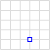

# leaflet 学习笔记

Leaflet 是一个**开源**并且对**移动端友好**的交互式**二维**地图 JS 库，拥有绝大部分开发者所需要的所有地图特性。

Leaflet **简单**、**高效**、**易用**。 它可以高效的运行在桌面和移动平台, 拥有着大量的**扩展插件**、 **优秀的文档**、简单**易用的 API** 和**完善的案例**, 以及可读性较好的源码。

> Leaflet 是一个易学、易用的二维地图库，**中文文档**完善，特性丰富，生态比较繁荣，对移动端友好，能满足大部分的二维地图需求。

## 快速入门

### 安装

多种方式安装 Leaflet，推荐使用 npm 安装。

```bash
pnpm i leaflet # 我使用的是 pnpm
pnpm i @types/leaflet -D # 类型声明
```

使用 vite + vue + ts 学习的，在 main.ts 引入 leaflet 的样式：

```ts
import 'leaflet/dist/leaflet.css'
```

### 使用

新建`InitMap.vue`

```ts
<script lang="ts" setup>
import L from 'leaflet'

const mapContainer = ref()
onMounted(() => {
  initMap(mapContainer.value)
})

function initMap(
  mapContainer: HTMLElement,
  coordinates: [number, number] = [26.55, 106.6],
  zoom: number = 11
) {
  const map = L.map(mapContainer).setView(coordinates, zoom)
  L.tileLayer('https://tile.openstreetmap.org/{z}/{x}/{y}.png', {
    maxZoom: 19,
  }).addTo(map)

  return map
}
</script>

<template>
  <div class="h-full" ref="mapContainer">
  </div>
</template>
```

`map`方法接收一个**元素**作为参数，作为防止地图的 div，返回一个地图对象。这个元素设置了一个固定高度，`h-full` 是`height:100%`，撑开到父元素的高度。

其他常用参数：

<!-- TODO -->

`setView` 接收一个坐标（维度和经度）和一个缩放级别作为参数，设置地图的中心点和缩放级别，返回地图对象。用于设置用户的初始视角（用户一开始看到地图的位置）。

```ts
L.tileLayer('https://tile.openstreetmap.org/{z}/{x}/{y}.png', {
  maxZoom: 19,
}).addTo(map)
```

使用一个瓦片图层作为底图，`tileLayer`方法接收一个 url 作为参数，第二个参数里的 maxZoom 指定地图的最大放缩级别。返回一个图层对象。`addTo`方法接收一个地图对象作为参数，将图层添加到地图上。

完成了一个简单的地图。

> 大多数 Leaflet 方法不显示声明返回值时，返回的都是地图对象，这样可以实现链式调用。

> leaflet 不绑定任何地图图层，需要自己添加。

可在地图上**添加标记**、**绘制几何图形**、添加**事件监听**、**弹出 popup** 和**其他图层**等，后续的内容围绕这些主题展开。

## 要素

地图上可添加实体或者要素（feature），实体可以是点、线、多边形或者圆圈。通过要素把数据展示在地图上，用户可以通过**点击**、**拖动**要素或者**hover**到要素上来获取更多信息。

### 标记

```ts
const marker = L.marker([26.55 /*纬度*/, 106.6 /*经度*/]).addTo(map) // 创建一个标记，添加到地图的经纬度位置
```

`marker`两个参数，第一个是坐标，第二个是可选参数，用于设置标记的图标。不传递第二个参数时，会使用默认的图标。


[标记文档](https://leafletjs.cn/reference.html#marker)

第二个参数常用的选项：

```ts
const options = {
  icon: new IconDefault(), // 自定义图标
  title: '', // 和 dom title 属性一样，鼠标悬停时显示, 默认是空字符串
  alt: 'Marker', // 和 img alt 属性一样，图片加载失败时显示
  opacity: 1, // 标记的透明度
  draggable: false, // 标记是否可以拖动
}
```

> 这些属性值默认值。

如何自定义标记的图标？

leaflet 提供了一个`Icon`类，用于创建自定义的图标。

```ts
const myIcon = L.icon({
  iconUrl: 'my-icon.png', // 第一个地图地址或者直接是一个 base64 编码的图片。或者直接导入图片
  iconSize: [20, 40],
  iconAnchor: [22, 94],
})
```

[更多自定义图标的教程](https://leafletjs.cn/examples/custom-icons/)

### 圆圈

```ts
L.circle(GuiYangPosition, {
  color: 'red',
  fillColor: '#f03',
  fillOpacity: 0.5,
  radius: 5000,
}).addTo(map)
```

要素的更多内容，后面学习`geoJSON`时，还会再讲。

## popup 弹出框

将某些信息附加到地图上的特定要素时，通常会使用 Popups。当用户操作是，比如点击或者 hover 到要素上时，会显示一个弹出框，告知更多信息。

```ts
const marker = L.marker([26.55, 106.6]).addTo(map) // 添加标记到地图上
marker.bindPopup('<p>我是一个 popup</p>').openPopup() // 弹出 popup
// 顺序重要，先添加标记到地图，后绑定 popup 内容，再打开 popup
```

`bindPopup` 方法接收一个字符串作为参数，设置 popup 的内容。`openPopup` 方法打开**标记**上的 popup。**用户不需要点击标记，弹窗已经打开了**。

> openPopup 是图层上的一个方法，可使用它打开**标记**上的 popup。其他要素不能使用这个方法，用户点击要素才能打开 popup。

bindPopup 第一个参数可以是`innerHTML`即字符串，也可以是一个`HTMLElement`，还可以是一个函数，返回 innerHTML，比如：

```ts
const marker = L.marker([26.55, 106.6]).addTo(map)
const span = document.createElement('span')
span.style.color = 'red'
span.innerHTML = '我是一个 popup'
marker.bindPopup(span).openPopup()
```

接收一个函数，返回一个`innerHTML`：

```ts
const marker = L.marker([26.55, 106.6]).addTo(map)
const contentFn = layer => {
  return `<span style="background-color:red;color:#fff;font-size:20px">我是函数返回的innerHtml</span>`
}
marker.bindPopup(contentFn).openPopup()
```

> 如何让 popup 的内容可以是 vue 组件？

构造一个函数，该函数接收 vue 组件和 props，返回一个函数给 bindPopup。

```ts
const marker = L.marker([26.55, 106.6]).addTo(map)
function componentAsContent(VueComponent, props, mountEl = 'div') {
  const container = document.createElement(mountEl)
  return layer => {
    return createApp(VueComponent, props).mount(container).$el
  }
}

marker
  .bindPopup(componentAsContent(AntDesignDemos, { title: '使用vue组件' }), {
    closeButton: false,
    autoClose: false,
  })
  .openPopup()
```

> 关键，借助`createApp`来挂载组件，然后返回组件的渲染结果。这样一改造，当展示复杂内容时，或者弹窗里需要使用组件库的组件开展示数据时，就非常强大了。

还是可以直接在图层上添加一个**孤立的弹窗**：

```ts
const GuiYangPosition: [number, number] = [26.55, 106.6]
const popupContent = `<div style="background-color:red;color:#fff;font-size:20px">I am a standalone popup.我是一个孤立的弹窗。</div>`
const popup = L.popup().setLatLng(GuiYangPosition).setContent(popupContent)
popup.openOn(map)
```

`setContent` 接收一个参数，和`bindPopup`的第一个参数类型一样。

## 图层

```ts

```

## 地理信息数据结构

表示地理信息的数据格式有多种：`geoJSON`、`WKT`、`WKB`、`GML`、`GPX`、`KML`、`TopoJSON`等。

### geoJSON

geoJSON 是一种用于表示地理信息的数据结构，它是一种 JSON 格式的数据，可以用于表示点、线、面等实体。2016 年被 IETF 标准化为 RFC 7946。Leaflet 也是支持 geoJSON 格式的数据的。

一个 GeoJSON 对象可以是 Geometry, Feature 或者 FeatureCollection。

其几何对象包括有点（表示位置）、线（表示街道、公路、边界）、多边形（表示国家、省、领土），以及由以上类型组合成的复合几何图形。

> TopoJSON（英语：TopoJSON]]）基于 GeoJSON 作了扩展，使得文件更小。

#### 基本几何体

> 点

```json
{
  "type": "Point",
  "coordinates": [30, 10]
}
```



> 线段

```json
{
  "type": "LineString",
  "coordinates": [
    [30, 10],
    [10, 30],
    [40, 40]
  ]
}
```


> 多边形或面

```json
{
  "type": "Polygon",
  "coordinates": [
    [
      [30, 10],
      [40, 40],
      [20, 40],
      [10, 20],
      [30, 10]
    ]
  ]
}
```


```json
{
  "type": "Polygon",
  "coordinates": [
    [
      [35, 10],
      [45, 45],
      [15, 40],
      [10, 20],
      [35, 10]
    ],
    [
      [20, 30],
      [35, 35],
      [30, 20],
      [20, 30]
    ]
  ]
}
```


#### 复合几何体

[维基百科例子](https://www.wikiwand.com/zh-cn/GeoJSON)

#### 相关资源

[获取 geojson](http://datav.aliyun.com/portal/school/atlas/area_selector#&lat=33.521903996156105&lng=104.29849999999999&zoom=4)

[另一获取 geojson 的网站](http://geojson.io/#map=2/0/20)

### 参考

[【第三章 数据格式】geojson 格式详解](https://zhuanlan.zhihu.com/p/510882183)

[维基百科 geoJSON](ttps://www.wikiwand.com/zh-cn/GeoJSON)

[GeoJSON 格式入门](https://mahouoji.com/geojson-101)

[geoJson 格式说明](https://chenoge.github.io/2019/07/18/geoJson%E6%A0%BC%E5%BC%8F/)

### WKT

## 问题

1. 不支持 ES6 按需引入吗？
